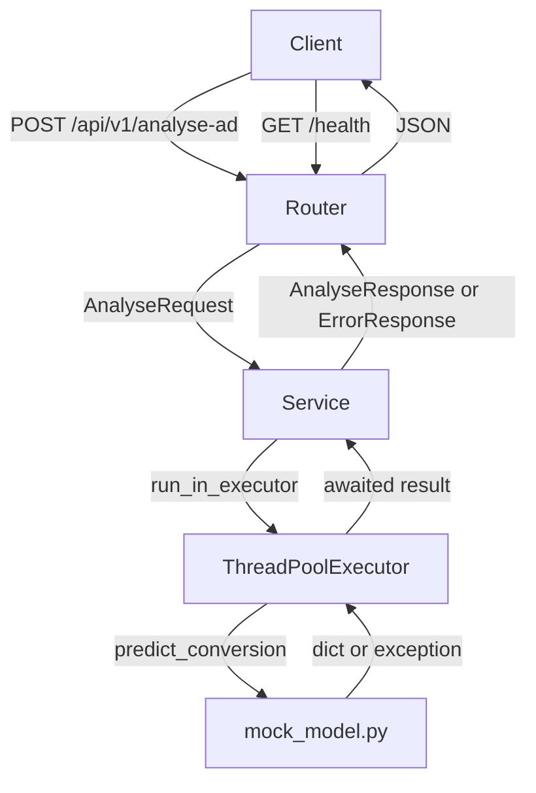
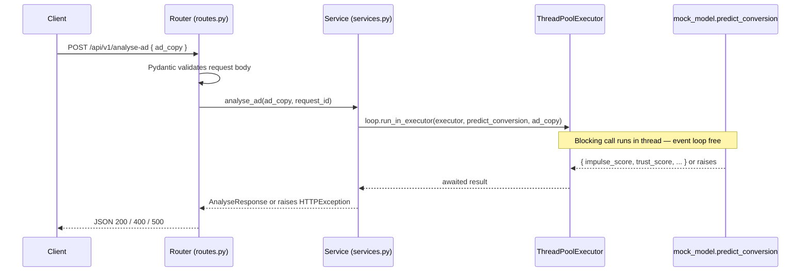

# Design Document: FastAPI Ad Analyser

## Overview

The FastAPI Ad Analyser wraps the existing `mock_model.py` ML inference function (`predict_conversion`) in a production-ready HTTP API. The service accepts ad copy text via a REST endpoint, offloads the blocking model call to a thread pool so the async event loop stays responsive, and returns structured prediction scores. The project is containerised with Docker, covered by a pytest test suite, and deployed via a GitHub Actions CI/CD pipeline targeting AWS ECR.

### Key Design Goals

- **Non-blocking inference**: `predict_conversion` sleeps for 2–4 seconds; it must never block the event loop.
- **Consistent error contract**: every response — success or failure — shares the same envelope shape with a `request_id`.
- **Modular structure**: routes, schemas, services, and config are separate modules from day one.
- **Step-by-step delivery**: foundation (app skeleton + health) → core endpoint → error handling → logging → Docker → CI/CD → tests.

---

## Architecture



### Request Lifecycle



### Module Dependency Graph

```
app/
├── main.py          ← creates FastAPI app, registers router, lifespan
├── config.py        ← Settings (pydantic-settings / os.getenv)
├── routes.py        ← HTTP handlers; imports schemas + services
├── schemas.py       ← Pydantic request/response models
└── services.py      ← business logic + executor; imports schemas + config
                       does NOT import routes
```

Dependency direction: `routes → services → config`, `routes → schemas`, `services → schemas`. No circular imports.

---

## Components and Interfaces

### 1. `config.py` — Application Settings

Loads all tuneable values from environment variables with documented defaults.

```python
class Settings:
    host: str          # default "0.0.0.0"
    port: int          # default 8000
    log_level: str     # default "INFO"
    workers: int       # default 1 (Uvicorn/Gunicorn worker count)
    executor_threads: int  # default 4 (ThreadPoolExecutor max_workers)
```

Instantiated once as a module-level singleton (`settings = Settings()`). All other modules import `settings`.

### 2. `schemas.py` — Pydantic Models

**Request**

```python
class AnalyseRequest(BaseModel):
    ad_copy: str = Field(..., min_length=1)
```

`min_length=1` rejects empty strings at the Pydantic layer (HTTP 422). Strings of 1–9 characters pass Pydantic and are rejected by the model layer (HTTP 400), per Requirement 4.3.

**Success Response**

```python
class PredictionData(BaseModel):
    impulse_score: float
    trust_score: float
    conversion_probability: float
    model_version: str

class AnalyseResponse(BaseModel):
    success: bool = True
    request_id: str
    data: PredictionData
```

**Error Response**

```python
class ErrorDetail(BaseModel):
    message: str

class ErrorResponse(BaseModel):
    success: bool = False
    request_id: str
    error: ErrorDetail
```

### 3. `services.py` — Ad Analyser Service

The service layer owns the executor and all model-call logic.

```python
class AdAnalyserService:
    def __init__(self, executor: ThreadPoolExecutor): ...

    async def analyse_ad(self, ad_copy: str, request_id: str) -> PredictionData:
        loop = asyncio.get_event_loop()
        result = await loop.run_in_executor(
            self._executor, predict_conversion, ad_copy
        )
        return PredictionData(**result)
```

Exception mapping (raised as `HTTPException` or caught in the route handler):

| Model exception | HTTP status | Response shape |
|---|---|---|
| `ValueError` | 400 | `ErrorResponse` |
| `RuntimeError` | 500 | `ErrorResponse` |
| Any other `Exception` | 500 | `ErrorResponse` (generic message, no stack trace) |

The service re-raises mapped `HTTPException` instances; the route handler catches them and builds the `ErrorResponse` envelope with the `request_id`.

### 4. `routes.py` — HTTP Handlers

```python
router = APIRouter(prefix="/api/v1")

@router.post("/analyse-ad", response_model=AnalyseResponse)
async def analyse_ad(request: AnalyseRequest, service: AdAnalyserService = Depends(...)):
    request_id = str(uuid.uuid4())
    # logging: request received
    try:
        data = await service.analyse_ad(request.ad_copy, request_id)
        # logging: success + response time
        return AnalyseResponse(success=True, request_id=request_id, data=data)
    except HTTPException as exc:
        # logging: error
        return JSONResponse(
            status_code=exc.status_code,
            content=ErrorResponse(request_id=request_id, error=ErrorDetail(message=exc.detail)).model_dump()
        )
    except Exception:
        # logging: unexpected error (no stack trace in response)
        return JSONResponse(
            status_code=500,
            content=ErrorResponse(request_id=request_id, error=ErrorDetail(message="An unexpected error occurred.")).model_dump()
        )
```

A separate health router (or plain route on the root app) handles `GET /health`.

### 5. `main.py` — Application Factory

```python
app = FastAPI(title="Ad Analyser API")

@asynccontextmanager
async def lifespan(app: FastAPI):
    executor = ThreadPoolExecutor(max_workers=settings.executor_threads)
    app.state.executor = executor
    app.state.service = AdAnalyserService(executor)
    yield
    executor.shutdown(wait=True)

app.include_router(router)
app.include_router(health_router)
```

The executor is created once at startup and shut down cleanly on teardown, avoiding thread leaks.

### 6. Dockerfile

Multi-stage-friendly single-stage build using `python:3.11-slim`:

1. Copy and install `requirements.txt` first (layer cache).
2. Copy application source.
3. Create and switch to a non-root user (`appuser`).
4. `EXPOSE 8000`.
5. `CMD ["uvicorn", "app.main:app", "--host", "0.0.0.0", "--port", "8000", "--workers", "1"]`

For production scale-out, swap to `gunicorn -k uvicorn.workers.UvicornWorker`.

### 7. GitHub Actions CI/CD (`.github/workflows/deploy.yml`)

```
jobs:
  test-build-push:
    steps:
      1. Checkout
      2. Set up Python, install deps
      3. Run pytest  ← fails fast; build does not proceed on test failure
      4. Configure AWS credentials (secrets: AWS_ACCESS_KEY_ID, AWS_SECRET_ACCESS_KEY, AWS_REGION)  # TODO
      5. Login to ECR
      6. Build Docker image, tag with ${{ github.sha }}
      7. Push to ECR_REPOSITORY  # TODO
```

---

## Data Models

### Request Payload

```json
{
  "ad_copy": "string (non-empty, min_length=1)"
}
```

### Success Response (HTTP 200)

```json
{
  "success": true,
  "request_id": "550e8400-e29b-41d4-a716-446655440000",
  "data": {
    "impulse_score": 0.82,
    "trust_score": 0.61,
    "conversion_probability": 0.74,
    "model_version": "v1.0-mock"
  }
}
```

### Error Response (HTTP 400 / 500)

```json
{
  "success": false,
  "request_id": "550e8400-e29b-41d4-a716-446655440000",
  "error": {
    "message": "Input text must be at least 10 characters for analysis."
  }
}
```

### Health Response (HTTP 200)

```json
{ "status": "ok" }
```

---

## Correctness Properties

*A property is a characteristic or behavior that should hold true across all valid executions of a system — essentially, a formal statement about what the system should do. Properties serve as the bridge between human-readable specifications and machine-verifiable correctness guarantees.*

This feature is a well-structured API with clear input/output behavior and business logic (request validation, error mapping, response construction). Property-based testing applies to the response-shape and error-handling logic, where input variation (different ad_copy strings) meaningfully exercises different code paths and edge cases.

---

### Property 1: Valid request always produces a well-formed success response

*For any* non-empty `ad_copy` string of length ≥ 10 that does not contain `"force_runtime_error"`, a POST to `/api/v1/analyse-ad` SHALL return HTTP 200 with `success: true`, a non-empty UUID `request_id`, and all four prediction fields (`impulse_score`, `trust_score`, `conversion_probability`, `model_version`) present with their correct types.

**Validates: Requirements 1.2, 1.3, 10.1**

---

### Property 2: Every response always contains a valid UUID request_id

*For any* request to `POST /api/v1/analyse-ad` — regardless of whether it succeeds, triggers a `ValueError`, or triggers a `RuntimeError` — the response body SHALL always contain a `request_id` field that is a non-empty, valid UUID v4 string.

**Validates: Requirements 1.3, 3.3, 10.5**

---

### Property 3: Short ad_copy always produces a well-formed HTTP 400 error response

*For any* `ad_copy` string with length between 1 and 9 characters (inclusive), a POST to `/api/v1/analyse-ad` SHALL return HTTP 400 with `success: false`, a non-empty `request_id`, and an `error.message` string that is non-empty.

**Validates: Requirements 3.1, 4.3, 10.2**

---

### Property 4: Every request produces INFO log entries containing the request_id

*For any* valid request to `POST /api/v1/analyse-ad`, the application logger SHALL emit at least two INFO-level log entries: one when the request is received and one when the prediction is returned, and both entries SHALL contain the `request_id` assigned to that request.

**Validates: Requirements 6.1, 6.2**

---

## Error Handling

### Error Mapping Table

| Trigger | Exception | HTTP Status | `success` | Response field |
|---|---|---|---|---|
| `ad_copy` missing | Pydantic `ValidationError` | 422 | — (FastAPI default) | FastAPI validation detail |
| `ad_copy` empty string | Pydantic `ValidationError` | 422 | — | FastAPI validation detail |
| `ad_copy` length 1–9 | `ValueError` from model | 400 | `false` | `error.message` |
| `"force_runtime_error"` in `ad_copy` | `RuntimeError` from model | 500 | `false` | `error.message` |
| Any other unhandled exception | `Exception` | 500 | `false` | Generic message, no stack trace |

### Design Decisions

**Why catch exceptions in the route handler rather than a global exception handler?**
The `request_id` is generated in the route handler. A global FastAPI exception handler does not have access to the per-request `request_id` without thread-local or context-var plumbing. Catching in the route handler keeps the `request_id` in scope and avoids that complexity.

**Why re-raise as `HTTPException` from the service rather than returning a value?**
The service layer should not know about HTTP. It raises typed exceptions (`ValueError`, `RuntimeError`); the route handler maps them to HTTP status codes. This keeps the service testable without an HTTP context.

**Stack trace suppression**
The catch-all `except Exception` block logs the full traceback at ERROR level (for operators) but returns only a generic message to the client. This prevents information leakage.

---

## Testing Strategy

### Dual Testing Approach

Unit/example tests cover specific scenarios and edge cases. Property-based tests verify universal invariants across a wide input space. Both are needed.

### Property-Based Testing

The feature has clear input/output behavior suitable for PBT. The chosen library is **[Hypothesis](https://hypothesis.readthedocs.io/)** (Python's standard PBT library).

- Minimum **100 iterations** per property test (Hypothesis default is 100; set `@settings(max_examples=100)`).
- Each property test is tagged with a comment referencing the design property.
- Tag format: `# Feature: fastapi-ad-analyser, Property {N}: {property_text}`
- The model is **always mocked** (`unittest.mock.patch("app.services.predict_conversion")`) so tests do not incur the 2–4 second sleep.

**Property test implementations:**

| Property | Hypothesis strategy | Assertion |
|---|---|---|
| P1: Valid request → well-formed 200 | `st.text(min_size=10).filter(lambda s: "force_runtime_error" not in s.lower())` | status=200, all fields present, correct types |
| P2: request_id always present | `st.one_of(valid_ad_copy, short_ad_copy, runtime_error_ad_copy)` | `request_id` is non-empty UUID v4 |
| P3: Short ad_copy → 400 | `st.text(min_size=1, max_size=9)` | status=400, success=false, error.message non-empty |
| P4: Logging contains request_id | `st.text(min_size=10).filter(...)` | captured log records contain request_id |

### Unit / Example Tests

| Test | Scenario | Expected |
|---|---|---|
| `test_health_ok` | GET /health | 200, `{"status": "ok"}` |
| `test_missing_ad_copy` | POST body `{}` | 422 |
| `test_empty_ad_copy` | POST `{"ad_copy": ""}` | 422 |
| `test_runtime_error` | POST `{"ad_copy": "force_runtime_error ..."}` | 500, success=false |
| `test_unexpected_error` | Service raises `Exception` | 500, no stack trace in body |
| `test_health_response_time` | GET /health | response time < 500ms |

### Test Infrastructure

- **`conftest.py`**: creates a `TestClient` wrapping the FastAPI app; patches `predict_conversion` globally for the test session.
- **Mock return value**: `{"impulse_score": 0.75, "trust_score": 0.5, "conversion_probability": 0.6, "model_version": "v1.0-mock"}` (deterministic, no sleep).
- **Runnable**: `pytest` from project root with no extra flags; `pytest.ini` or `pyproject.toml` sets `testpaths = tests`.

### File Layout

```
tests/
├── conftest.py          ← TestClient, mock fixture
├── test_health.py       ← health endpoint examples
├── test_analyse.py      ← example-based tests for analyse endpoint
└── test_properties.py   ← Hypothesis property tests (P1–P4)
```
