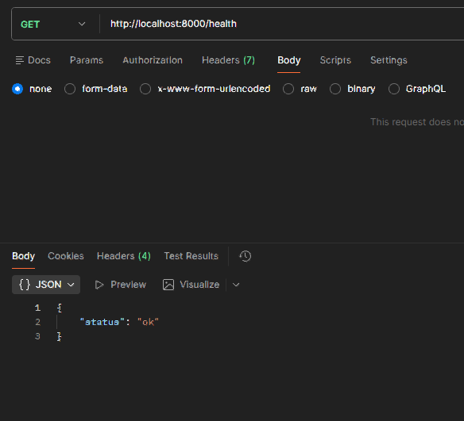
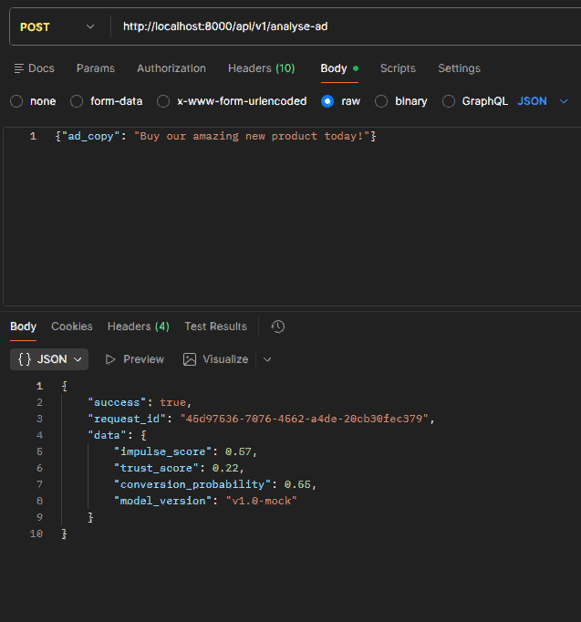
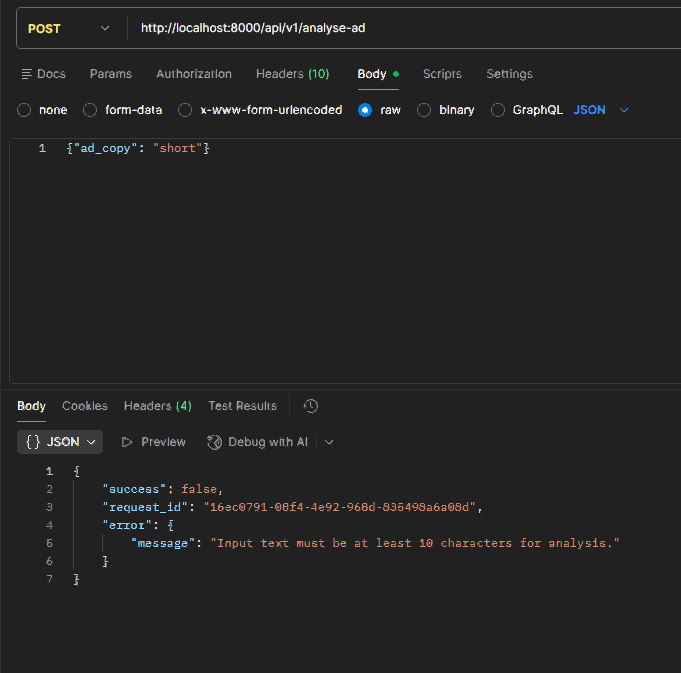
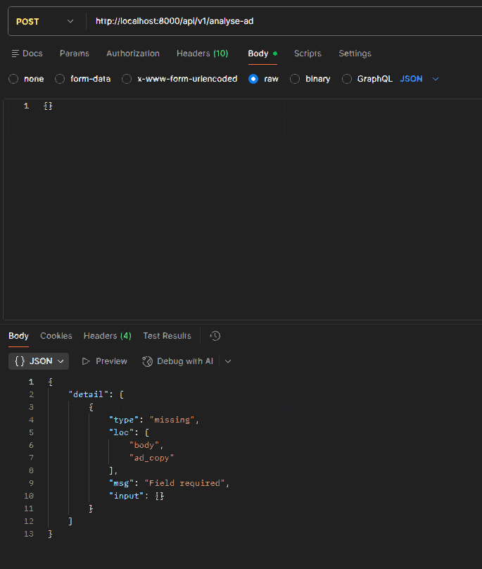
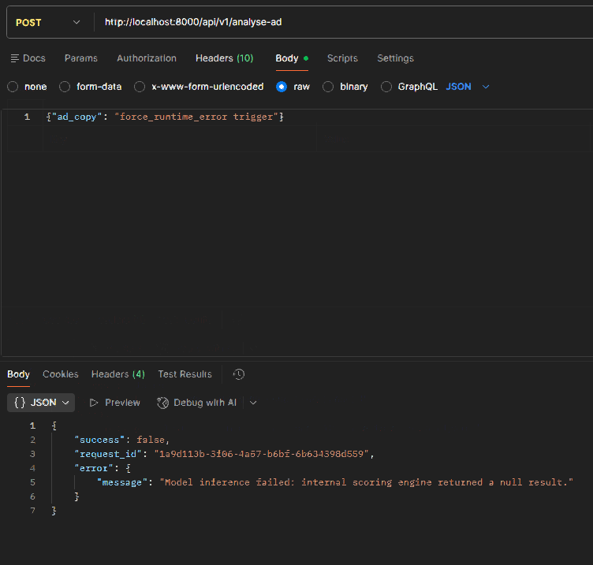
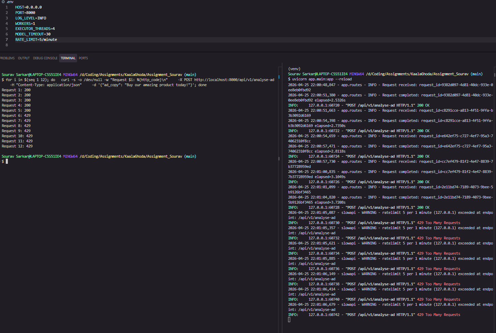

# Ad Analyser API

A production-ready FastAPI service that wraps `mock_model.py`'s `predict_conversion` function to score advertising copy for conversion potential. Every response — success or error — carries a UUID `request_id` for end-to-end traceability.

---

## Prerequisites

- Python 3.11+
- Docker & Docker Compose (for containerised runs)

---

## Local Setup

```bash
python -m venv venv
source venv/Scripts/activate   # Windows (Git Bash)
# source venv/bin/activate      # macOS / Linux

pip install -r requirements.txt
uvicorn app.main:app --reload
```

The API will be available at `http://localhost:8000`.  
Interactive docs (Swagger UI): `http://localhost:8000/docs`

---

## Running Tests

```bash
pytest tests/ -v
```

The suite includes unit tests, integration tests, and Hypothesis property-based tests (400 examples across 4 properties).

---

## Docker Usage

**Build and run with Docker Compose (recommended):**

```bash
docker compose up --build
```

**Or build and run manually:**

```bash
docker build -t ad-analyser .
docker run -p 8000:8000 ad-analyser
```

---

## API Endpoints

| Method | Path | Description |
|--------|------|-------------|
| `GET` | `/health` | Liveness check — returns `{"status": "ok"}` |
| `GET` | `/metrics` | In-memory request counters since last restart |
| `POST` | `/api/v1/analyse-ad` | Analyse ad copy and return conversion scores |

### POST /api/v1/analyse-ad

**Request:**
```json
{ "ad_copy": "Crafted in small batches. Available to those who know where to look." }
```

**Success (HTTP 200):**
```json
{
  "success": true,
  "request_id": "a3f1c2d4-7e6b-4a2f-9c1d-0e8f3b5a7c2e",
  "data": {
    "impulse_score": 0.81,
    "trust_score": 0.42,
    "conversion_probability": 0.67,
    "model_version": "v1.0-mock"
  }
}
```

**Error (HTTP 400 / 500):**
```json
{
  "success": false,
  "request_id": "a3f1c2d4-7e6b-4a2f-9c1d-0e8f3b5a7c2e",
  "error": { "message": "Input text must be at least 10 characters for analysis." }
}
```

---

## How Async Routing Works for the Slow ML Function

### Why a plain `async def` is not sufficient

`predict_conversion` calls `time.sleep()` — a blocking operation. If you simply mark the route handler `async def` and call the function directly, the `time.sleep()` still runs on the event loop thread. This freezes the entire event loop for 2–4 seconds, meaning **no other requests can be accepted or processed** during that time. The `async` keyword alone does not make blocking code non-blocking.

### What we do instead

The blocking call is offloaded to a `ThreadPoolExecutor` using `asyncio.wait_for` + `loop.run_in_executor`:

```python
loop = asyncio.get_event_loop()
future = loop.run_in_executor(self._executor, predict_conversion, ad_copy)
result = await asyncio.wait_for(future, timeout=30.0)
```

`run_in_executor` submits the blocking function to a thread pool and returns an awaitable future. The event loop is free to handle other requests while the thread runs `predict_conversion`. When the thread finishes, the event loop resumes the handler with the result.

The `ThreadPoolExecutor` is created once at application startup (via FastAPI's lifespan context manager) and shut down cleanly on teardown — never per-request.

### Timeout handling

`asyncio.wait_for` wraps the executor future with a configurable timeout (default 30s, controlled by `MODEL_TIMEOUT`). If the model call exceeds the timeout, the service raises HTTP 504 rather than hanging indefinitely.

---

## Environment Variables

| Variable | Default | Description |
|----------|---------|-------------|
| `HOST` | `0.0.0.0` | Host address the server binds to |
| `PORT` | `8000` | Port the server listens on |
| `LOG_LEVEL` | `INFO` | Logging level: `DEBUG`, `INFO`, `WARNING`, `ERROR` |
| `WORKERS` | `1` | Number of Uvicorn worker processes |
| `EXECUTOR_THREADS` | `4` | `ThreadPoolExecutor` pool size for model inference |
| `MODEL_TIMEOUT` | `30` | Seconds before a model call times out (0 = no timeout) |
| `RATE_LIMIT` | `10/minute` | Max requests per IP per window on the analyse endpoint |

Copy `.env.example` to `.env` and adjust values as needed.

---

## CI/CD Pipeline

Defined in `.github/workflows/deploy.yml`. Triggers on every push to `main`:

1. Checkout code
2. Set up Python 3.11, install dependencies
3. Run `pytest tests/` — pipeline halts on failure
4. Configure AWS credentials (via GitHub Actions secrets)
5. Log in to Amazon ECR
6. Build Docker image, tag with commit SHA **and** `latest`
7. Push both tags to ECR

Required GitHub Actions secrets: `AWS_ACCESS_KEY_ID`, `AWS_SECRET_ACCESS_KEY`, `AWS_REGION`, `ECR_REPOSITORY`.

---

## API in Action

### Health check — GET /health


### Successful prediction — POST /api/v1/analyse-ad


### Short ad copy (< 10 chars) — HTTP 400


### Empty request body — HTTP 422


### Runtime error trigger — HTTP 500


### Rate limiting — HTTP 429


---

## Tradeoffs & Assumptions

- **Single-file model**: `mock_model.py` is copied into the image as-is. In production this would be replaced by a proper model package or S3-loaded artifact.
- **ThreadPoolExecutor vs ProcessPoolExecutor**: A thread pool is used because `predict_conversion` is I/O-bound (sleep). A CPU-bound model would warrant a `ProcessPoolExecutor` or a separate worker process.
- **Workers=1 in Docker CMD**: Kept at 1 for simplicity. For production scale-out, swap to `gunicorn -k uvicorn.workers.UvicornWorker` with multiple workers, or run multiple container replicas behind a load balancer.
- **No persistent storage**: The service is stateless — no database or cache. Each request is independent.
